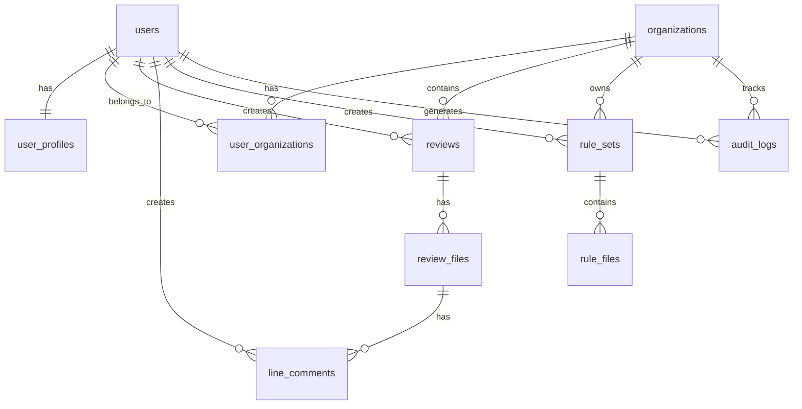

# データベース設計

## 1. データベース概要

### 1.1 データベース戦略

- **Supabase PostgreSQL**: メインデータベース
- **Row Level Security (RLS)**: アクセス制御
- **リアルタイム機能**: Supabase Realtime
- **バックアップ**: 自動バックアップ + PITR

### 1.2 設計原則

- **正規化**: 適切な正規化による データ整合性
- **パフォーマンス**: インデックス最適化
- **スケーラビリティ**: 水平スケーリング対応
- **セキュリティ**: RLS によるデータ保護

## 2. テーブル設計

### 2.1 認証関連テーブル

#### users (Supabase Auth標準)

```sql
-- Supabase Authが自動で作成・管理
-- 基本的なユーザー認証情報を保存
CREATE TABLE auth.users (
  id UUID PRIMARY KEY DEFAULT uuid_generate_v4(),
  aud VARCHAR(255),
  role VARCHAR(255),
  email VARCHAR(255) UNIQUE,
  encrypted_password VARCHAR(255),
  email_confirmed_at TIMESTAMPTZ,
  invited_at TIMESTAMPTZ,
  confirmation_token VARCHAR(255),
  confirmation_sent_at TIMESTAMPTZ,
  recovery_token VARCHAR(255),
  recovery_sent_at TIMESTAMPTZ,
  email_change_token_new VARCHAR(255),
  email_change VARCHAR(255),
  email_change_sent_at TIMESTAMPTZ,
  last_sign_in_at TIMESTAMPTZ,
  raw_app_meta_data JSONB,
  raw_user_meta_data JSONB,
  is_super_admin BOOLEAN,
  created_at TIMESTAMPTZ DEFAULT NOW(),
  updated_at TIMESTAMPTZ DEFAULT NOW()
);
```

#### user_profiles (カスタム)

```sql
-- ユーザーの詳細プロファイル情報
CREATE TABLE public.user_profiles (
  id UUID PRIMARY KEY DEFAULT uuid_generate_v4(),
  user_id UUID REFERENCES auth.users(id) ON DELETE CASCADE UNIQUE NOT NULL,
  provider VARCHAR(50) NOT NULL, -- 'github' or 'gitlab'
  provider_id VARCHAR(255) NOT NULL,
  username VARCHAR(255) NOT NULL,
  display_name VARCHAR(255),
  avatar_url TEXT,
  email VARCHAR(255),
  bio TEXT,
  location VARCHAR(255),
  website_url TEXT,
  company VARCHAR(255),
  github_data JSONB, -- GitHub固有のデータ
  gitlab_data JSONB, -- GitLab固有のデータ
  preferences JSONB DEFAULT '{}', -- ユーザー設定
  created_at TIMESTAMPTZ DEFAULT NOW(),
  updated_at TIMESTAMPTZ DEFAULT NOW()
);

-- インデックス
CREATE INDEX idx_user_profiles_user_id ON user_profiles(user_id);
CREATE INDEX idx_user_profiles_provider ON user_profiles(provider);
CREATE INDEX idx_user_profiles_username ON user_profiles(username);

-- RLS ポリシー
ALTER TABLE user_profiles ENABLE ROW LEVEL SECURITY;

CREATE POLICY "Users can view own profile" ON user_profiles
  FOR SELECT USING (auth.uid() = user_id);

CREATE POLICY "Users can update own profile" ON user_profiles
  FOR UPDATE USING (auth.uid() = user_id);

CREATE POLICY "Users can insert own profile" ON user_profiles
  FOR INSERT WITH CHECK (auth.uid() = user_id);
```

#### provider_tokens (暗号化トークン保存)

```sql
-- プロバイダーのアクセストークンを暗号化して保存
CREATE TABLE public.provider_tokens (
  id UUID PRIMARY KEY DEFAULT uuid_generate_v4(),
  user_id UUID REFERENCES auth.users(id) ON DELETE CASCADE NOT NULL,
  provider VARCHAR(50) NOT NULL, -- 'github' or 'gitlab'
  encrypted_token TEXT NOT NULL, -- 暗号化されたトークン
  token_type VARCHAR(50) DEFAULT 'bearer',
  expires_at TIMESTAMPTZ,
  scope TEXT[],
  created_at TIMESTAMPTZ DEFAULT NOW(),
  updated_at TIMESTAMPTZ DEFAULT NOW(),
  UNIQUE(user_id, provider)
);

-- インデックス
CREATE INDEX idx_provider_tokens_user_provider ON provider_tokens(user_id, provider);

-- RLS ポリシー
ALTER TABLE provider_tokens ENABLE ROW LEVEL SECURITY;

CREATE POLICY "Users can access own tokens" ON provider_tokens
  FOR ALL USING (auth.uid() = user_id);
```

### 2.2 組織・チーム管理

#### organizations

```sql
-- 組織・チーム情報
CREATE TABLE public.organizations (
  id UUID PRIMARY KEY DEFAULT uuid_generate_v4(),
  name VARCHAR(255) NOT NULL,
  slug VARCHAR(100) UNIQUE NOT NULL, -- URL用のスラッグ
  avatar_url TEXT,
  description TEXT,
  website_url TEXT,
  github_org_id INTEGER, -- GitHub組織ID
  gitlab_group_id INTEGER, -- GitLab グループID
  settings JSONB DEFAULT '{}', -- 組織設定
  created_at TIMESTAMPTZ DEFAULT NOW(),
  updated_at TIMESTAMPTZ DEFAULT NOW()
);

-- インデックス
CREATE INDEX idx_organizations_slug ON organizations(slug);
CREATE INDEX idx_organizations_github_org_id ON organizations(github_org_id) WHERE github_org_id IS NOT NULL;
CREATE INDEX idx_organizations_gitlab_group_id ON organizations(gitlab_group_id) WHERE gitlab_group_id IS NOT NULL;

-- RLS ポリシー
ALTER TABLE organizations ENABLE ROW LEVEL SECURITY;

CREATE POLICY "Organization members can view" ON organizations
  FOR SELECT USING (
    id IN (
      SELECT organization_id FROM user_organizations 
      WHERE user_id = auth.uid()
    )
  );
```

#### user_organizations

```sql
-- ユーザーと組織の関連
CREATE TABLE public.user_organizations (
  id UUID PRIMARY KEY DEFAULT uuid_generate_v4(),
  user_id UUID REFERENCES auth.users(id) ON DELETE CASCADE NOT NULL,
  organization_id UUID REFERENCES organizations(id) ON DELETE CASCADE NOT NULL,
  role VARCHAR(50) NOT NULL DEFAULT 'member', -- 'owner', 'admin', 'member'
  permissions JSONB DEFAULT '{}', -- 詳細権限設定
  joined_at TIMESTAMPTZ DEFAULT NOW(),
  updated_at TIMESTAMPTZ DEFAULT NOW(),
  UNIQUE(user_id, organization_id)
);

-- インデックス
CREATE INDEX idx_user_organizations_user_id ON user_organizations(user_id);
CREATE INDEX idx_user_organizations_org_id ON user_organizations(organization_id);
CREATE INDEX idx_user_organizations_role ON user_organizations(role);

-- RLS ポリシー
ALTER TABLE user_organizations ENABLE ROW LEVEL SECURITY;

CREATE POLICY "Users can view own memberships" ON user_organizations
  FOR SELECT USING (auth.uid() = user_id);

CREATE POLICY "Org admins can view members" ON user_organizations
  FOR SELECT USING (
    organization_id IN (
      SELECT organization_id FROM user_organizations 
      WHERE user_id = auth.uid() AND role IN ('owner', 'admin')
    )
  );
```

### 2.3 レビューデータテーブル

#### reviews

```sql
-- メインのレビューデータ
CREATE TABLE public.reviews (
  id UUID PRIMARY KEY DEFAULT uuid_generate_v4(),
  user_id UUID REFERENCES auth.users(id) ON DELETE CASCADE NOT NULL,
  organization_id UUID REFERENCES organizations(id) ON DELETE SET NULL,
  
  -- PR/MR情報
  provider VARCHAR(50) NOT NULL, -- 'github' or 'gitlab'
  repository_url TEXT NOT NULL,
  pr_number INTEGER,
  mr_iid INTEGER,
  pr_url TEXT NOT NULL,
  
  -- プル/マージリクエストメタデータ
  title VARCHAR(500) NOT NULL,
  description TEXT,
  author_username VARCHAR(255),
  author_avatar_url TEXT,
  base_branch VARCHAR(255) NOT NULL,
  head_branch VARCHAR(255) NOT NULL,
  state VARCHAR(50) NOT NULL, -- 'open', 'closed', 'merged'
  
  -- レビュー設定
  rule_set_ids UUID[], -- 適用されたルールセット
  analysis_config JSONB DEFAULT '{}', -- 分析設定
  
  -- レビュー結果
  status VARCHAR(50) NOT NULL DEFAULT 'pending', -- 'pending', 'analyzing', 'completed', 'failed'
  overall_score INTEGER, -- 0-100のスコア
  total_files INTEGER DEFAULT 0,
  analyzed_files INTEGER DEFAULT 0,
  total_lines INTEGER DEFAULT 0,
  analyzed_lines INTEGER DEFAULT 0,
  issues_found INTEGER DEFAULT 0,
  
  -- Claude分析結果
  claude_summary TEXT, -- 全体的な分析結果
  claude_recommendations TEXT[], -- 推奨事項
  analysis_metadata JSONB DEFAULT '{}', -- 分析メタデータ
  
  -- 公開設定
  is_public BOOLEAN DEFAULT FALSE,
  is_shared_with_org BOOLEAN DEFAULT FALSE,
  
  -- タイムスタンプ
  analyzed_at TIMESTAMPTZ,
  created_at TIMESTAMPTZ DEFAULT NOW(),
  updated_at TIMESTAMPTZ DEFAULT NOW()
);

-- インデックス
CREATE INDEX idx_reviews_user_id ON reviews(user_id);
CREATE INDEX idx_reviews_organization_id ON reviews(organization_id) WHERE organization_id IS NOT NULL;
CREATE INDEX idx_reviews_provider ON reviews(provider);
CREATE INDEX idx_reviews_status ON reviews(status);
CREATE INDEX idx_reviews_created_at ON reviews(created_at DESC);
CREATE INDEX idx_reviews_pr_url ON reviews(pr_url);

-- RLS ポリシー
ALTER TABLE reviews ENABLE ROW LEVEL SECURITY;

CREATE POLICY "Users can view own reviews" ON reviews
  FOR SELECT USING (auth.uid() = user_id);

CREATE POLICY "Users can view public reviews" ON reviews
  FOR SELECT USING (is_public = true);

CREATE POLICY "Organization members can view org reviews" ON reviews
  FOR SELECT USING (
    is_shared_with_org = true AND
    organization_id IN (
      SELECT organization_id FROM user_organizations 
      WHERE user_id = auth.uid()
    )
  );

CREATE POLICY "Users can insert own reviews" ON reviews
  FOR INSERT WITH CHECK (auth.uid() = user_id);

CREATE POLICY "Users can update own reviews" ON reviews
  FOR UPDATE USING (auth.uid() = user_id);
```

#### review_files

```sql
-- レビュー対象ファイル情報
CREATE TABLE public.review_files (
  id UUID PRIMARY KEY DEFAULT uuid_generate_v4(),
  review_id UUID REFERENCES reviews(id) ON DELETE CASCADE NOT NULL,
  
  -- ファイル情報
  file_path TEXT NOT NULL,
  file_name VARCHAR(255) NOT NULL,
  file_extension VARCHAR(50),
  file_size INTEGER,
  
  -- 変更情報
  status VARCHAR(50) NOT NULL, -- 'added', 'modified', 'deleted', 'renamed'
  additions INTEGER DEFAULT 0,
  deletions INTEGER DEFAULT 0,
  changes INTEGER DEFAULT 0,
  
  -- 分析結果
  analysis_status VARCHAR(50) DEFAULT 'pending', -- 'pending', 'analyzing', 'completed', 'skipped', 'failed'
  language VARCHAR(100), -- プログラミング言語
  file_score INTEGER, -- 0-100のファイルスコア
  issues_count INTEGER DEFAULT 0,
  
  -- Claude分析結果
  claude_summary TEXT, -- ファイル分析サマリー
  claude_recommendations TEXT[], -- ファイル固有の推奨事項
  
  -- メタデータ
  metadata JSONB DEFAULT '{}',
  analyzed_at TIMESTAMPTZ,
  created_at TIMESTAMPTZ DEFAULT NOW(),
  updated_at TIMESTAMPTZ DEFAULT NOW()
);

-- インデックス
CREATE INDEX idx_review_files_review_id ON review_files(review_id);
CREATE INDEX idx_review_files_file_path ON review_files(file_path);
CREATE INDEX idx_review_files_status ON review_files(status);
CREATE INDEX idx_review_files_language ON review_files(language) WHERE language IS NOT NULL;

-- RLS ポリシー
ALTER TABLE review_files ENABLE ROW LEVEL SECURITY;

CREATE POLICY "Users can view files from accessible reviews" ON review_files
  FOR SELECT USING (
    review_id IN (
      SELECT id FROM reviews 
      WHERE auth.uid() = user_id 
        OR is_public = true 
        OR (is_shared_with_org = true AND organization_id IN (
          SELECT organization_id FROM user_organizations 
          WHERE user_id = auth.uid()
        ))
    )
  );
```

#### line_comments

```sql
-- 行単位のコメント・分析結果
CREATE TABLE public.line_comments (
  id UUID PRIMARY KEY DEFAULT uuid_generate_v4(),
  review_id UUID REFERENCES reviews(id) ON DELETE CASCADE NOT NULL,
  file_id UUID REFERENCES review_files(id) ON DELETE CASCADE NOT NULL,
  user_id UUID REFERENCES auth.users(id) ON DELETE CASCADE NOT NULL,
  
  -- 位置情報
  line_number INTEGER NOT NULL,
  column_start INTEGER,
  column_end INTEGER,
  
  -- コメント内容
  comment_type VARCHAR(100) NOT NULL, -- 'suggestion', 'issue', 'question', 'praise'
  severity VARCHAR(50) DEFAULT 'info', -- 'critical', 'major', 'minor', 'info'
  category VARCHAR(100), -- 'security', 'performance', 'maintainability', 'style', etc.
  title VARCHAR(500),
  description TEXT NOT NULL,
  suggested_fix TEXT, -- 修正提案
  
  -- Claude分析データ
  claude_confidence DECIMAL(3,2), -- 0.00-1.00の信頼度
  claude_reasoning TEXT, -- 判断理由
  rule_applied VARCHAR(255), -- 適用されたルール
  
  -- ステータス
  status VARCHAR(50) DEFAULT 'active', -- 'active', 'resolved', 'dismissed'
  resolved_by UUID REFERENCES auth.users(id),
  resolved_at TIMESTAMPTZ,
  resolution_comment TEXT,
  
  -- メタデータ
  metadata JSONB DEFAULT '{}',
  created_at TIMESTAMPTZ DEFAULT NOW(),
  updated_at TIMESTAMPTZ DEFAULT NOW()
);

-- インデックス
CREATE INDEX idx_line_comments_review_id ON line_comments(review_id);
CREATE INDEX idx_line_comments_file_id ON line_comments(file_id);
CREATE INDEX idx_line_comments_user_id ON line_comments(user_id);
CREATE INDEX idx_line_comments_line_number ON line_comments(line_number);
CREATE INDEX idx_line_comments_type ON line_comments(comment_type);
CREATE INDEX idx_line_comments_severity ON line_comments(severity);
CREATE INDEX idx_line_comments_status ON line_comments(status);

-- RLS ポリシー
ALTER TABLE line_comments ENABLE ROW LEVEL SECURITY;

CREATE POLICY "Users can view comments from accessible reviews" ON line_comments
  FOR SELECT USING (
    review_id IN (
      SELECT id FROM reviews 
      WHERE auth.uid() = user_id 
        OR is_public = true 
        OR (is_shared_with_org = true AND organization_id IN (
          SELECT organization_id FROM user_organizations 
          WHERE user_id = auth.uid()
        ))
    )
  );

CREATE POLICY "Users can insert comments on accessible reviews" ON line_comments
  FOR INSERT WITH CHECK (
    auth.uid() = user_id AND
    review_id IN (
      SELECT id FROM reviews 
      WHERE auth.uid() = user_id 
        OR (is_shared_with_org = true AND organization_id IN (
          SELECT organization_id FROM user_organizations 
          WHERE user_id = auth.uid()
        ))
    )
  );
```

### 2.4 ルール管理テーブル

#### rule_sets

```sql
-- コードレビュールールセット
CREATE TABLE public.rule_sets (
  id UUID PRIMARY KEY DEFAULT uuid_generate_v4(),
  created_by UUID REFERENCES auth.users(id) ON DELETE CASCADE NOT NULL,
  organization_id UUID REFERENCES organizations(id) ON DELETE CASCADE,
  
  -- ルールセット情報
  name VARCHAR(255) NOT NULL,
  description TEXT,
  version VARCHAR(50) DEFAULT '1.0.0',
  
  -- ルール内容
  claude_md_content TEXT NOT NULL, -- CLAUDE.mdファイルの内容
  imported_rules TEXT[], -- インポートされたルールファイル
  rule_categories JSONB DEFAULT '{}', -- カテゴリ別ルール分類
  
  -- 適用設定
  language_filters TEXT[], -- 対象言語フィルター
  file_pattern_filters TEXT[], -- ファイルパターンフィルター
  severity_config JSONB DEFAULT '{}', -- 重要度設定
  
  -- 共有設定
  is_public BOOLEAN DEFAULT FALSE,
  is_shared BOOLEAN DEFAULT FALSE,
  is_template BOOLEAN DEFAULT FALSE,
  
  -- 使用統計
  usage_count INTEGER DEFAULT 0,
  last_used_at TIMESTAMPTZ,
  
  -- メタデータ
  tags TEXT[],
  metadata JSONB DEFAULT '{}',
  created_at TIMESTAMPTZ DEFAULT NOW(),
  updated_at TIMESTAMPTZ DEFAULT NOW()
);

-- インデックス
CREATE INDEX idx_rule_sets_created_by ON rule_sets(created_by);
CREATE INDEX idx_rule_sets_organization_id ON rule_sets(organization_id) WHERE organization_id IS NOT NULL;
CREATE INDEX idx_rule_sets_name ON rule_sets(name);
CREATE INDEX idx_rule_sets_is_public ON rule_sets(is_public);
CREATE INDEX idx_rule_sets_tags ON rule_sets USING GIN(tags);

-- RLS ポリシー
ALTER TABLE rule_sets ENABLE ROW LEVEL SECURITY;

CREATE POLICY "Users can view own rule sets" ON rule_sets
  FOR SELECT USING (auth.uid() = created_by);

CREATE POLICY "Users can view public rule sets" ON rule_sets
  FOR SELECT USING (is_public = true);

CREATE POLICY "Users can view shared rule sets" ON rule_sets
  FOR SELECT USING (is_shared = true);

CREATE POLICY "Organization members can view org rule sets" ON rule_sets
  FOR SELECT USING (
    organization_id IN (
      SELECT organization_id FROM user_organizations 
      WHERE user_id = auth.uid()
    )
  );

CREATE POLICY "Users can insert own rule sets" ON rule_sets
  FOR INSERT WITH CHECK (auth.uid() = created_by);

CREATE POLICY "Users can update own rule sets" ON rule_sets
  FOR UPDATE USING (auth.uid() = created_by);
```

#### rule_files

```sql
-- インポート可能なルールファイル
CREATE TABLE public.rule_files (
  id UUID PRIMARY KEY DEFAULT uuid_generate_v4(),
  rule_set_id UUID REFERENCES rule_sets(id) ON DELETE CASCADE NOT NULL,
  
  -- ファイル情報
  file_name VARCHAR(255) NOT NULL,
  file_path TEXT NOT NULL, -- @rules/security.md 形式
  content TEXT NOT NULL,
  content_hash VARCHAR(64) NOT NULL, -- コンテンツのハッシュ値
  
  -- メタデータ
  file_size INTEGER,
  line_count INTEGER,
  created_at TIMESTAMPTZ DEFAULT NOW(),
  updated_at TIMESTAMPTZ DEFAULT NOW(),
  
  UNIQUE(rule_set_id, file_path)
);

-- インデックス
CREATE INDEX idx_rule_files_rule_set_id ON rule_files(rule_set_id);
CREATE INDEX idx_rule_files_file_path ON rule_files(file_path);
CREATE INDEX idx_rule_files_content_hash ON rule_files(content_hash);

-- RLS ポリシー
ALTER TABLE rule_files ENABLE ROW LEVEL SECURITY;

CREATE POLICY "Users can view rule files from accessible rule sets" ON rule_files
  FOR SELECT USING (
    rule_set_id IN (
      SELECT id FROM rule_sets 
      WHERE auth.uid() = created_by 
        OR is_public = true 
        OR is_shared = true
        OR organization_id IN (
          SELECT organization_id FROM user_organizations 
          WHERE user_id = auth.uid()
        )
    )
  );
```

### 2.5 システム・監査テーブル

#### audit_logs

```sql
-- 監査ログ
CREATE TABLE public.audit_logs (
  id UUID PRIMARY KEY DEFAULT uuid_generate_v4(),
  user_id UUID REFERENCES auth.users(id) ON DELETE SET NULL,
  organization_id UUID REFERENCES organizations(id) ON DELETE SET NULL,
  
  -- アクション情報
  action VARCHAR(100) NOT NULL, -- 'review_created', 'rule_applied', 'comment_added', etc.
  resource_type VARCHAR(100) NOT NULL, -- 'review', 'rule_set', 'comment', etc.
  resource_id UUID,
  
  -- 詳細情報
  details JSONB DEFAULT '{}',
  previous_values JSONB, -- 変更前の値
  new_values JSONB, -- 変更後の値
  
  -- リクエスト情報
  ip_address INET,
  user_agent TEXT,
  session_id UUID,
  
  -- タイムスタンプ
  timestamp TIMESTAMPTZ DEFAULT NOW()
);

-- インデックス
CREATE INDEX idx_audit_logs_user_id ON audit_logs(user_id) WHERE user_id IS NOT NULL;
CREATE INDEX idx_audit_logs_organization_id ON audit_logs(organization_id) WHERE organization_id IS NOT NULL;
CREATE INDEX idx_audit_logs_action ON audit_logs(action);
CREATE INDEX idx_audit_logs_resource ON audit_logs(resource_type, resource_id);
CREATE INDEX idx_audit_logs_timestamp ON audit_logs(timestamp DESC);

-- パーティショニング（月単位）
CREATE TABLE audit_logs_y2025m01 PARTITION OF audit_logs
  FOR VALUES FROM ('2025-01-01') TO ('2025-02-01');

-- RLS ポリシー
ALTER TABLE audit_logs ENABLE ROW LEVEL SECURITY;

CREATE POLICY "Users can view own audit logs" ON audit_logs
  FOR SELECT USING (auth.uid() = user_id);

CREATE POLICY "Org admins can view org audit logs" ON audit_logs
  FOR SELECT USING (
    organization_id IN (
      SELECT organization_id FROM user_organizations 
      WHERE user_id = auth.uid() AND role IN ('owner', 'admin')
    )
  );
```

#### system_metrics

```sql
-- システムメトリクス
CREATE TABLE public.system_metrics (
  id UUID PRIMARY KEY DEFAULT uuid_generate_v4(),
  metric_name VARCHAR(100) NOT NULL,
  metric_value DECIMAL(15,2) NOT NULL,
  dimensions JSONB DEFAULT '{}', -- 追加の次元データ
  timestamp TIMESTAMPTZ DEFAULT NOW()
);

-- インデックス
CREATE INDEX idx_system_metrics_name_timestamp ON system_metrics(metric_name, timestamp DESC);

-- パーティショニング（日単位）
CREATE TABLE system_metrics_y2025m01d01 PARTITION OF system_metrics
  FOR VALUES FROM ('2025-01-01') TO ('2025-01-02');

-- RLS は無効（システム内部での使用）
```

## 3. データ関連図



## 4. インデックス戦略

### 4.1 パフォーマンス最適化

```sql
-- 複合インデックス
CREATE INDEX idx_reviews_user_status_created ON reviews(user_id, status, created_at DESC);
CREATE INDEX idx_line_comments_review_file_line ON line_comments(review_id, file_id, line_number);
CREATE INDEX idx_user_organizations_org_role ON user_organizations(organization_id, role);

-- 部分インデックス
CREATE INDEX idx_reviews_public ON reviews(created_at DESC) WHERE is_public = true;
CREATE INDEX idx_rule_sets_templates ON rule_sets(name) WHERE is_template = true;

-- GINインデックス（JSON検索用）
CREATE INDEX idx_user_profiles_github_data ON user_profiles USING GIN(github_data);
CREATE INDEX idx_reviews_analysis_metadata ON reviews USING GIN(analysis_metadata);
CREATE INDEX idx_rule_sets_rule_categories ON rule_sets USING GIN(rule_categories);
```

### 4.2 フルテキスト検索

```sql
-- フルテキスト検索インデックス
ALTER TABLE reviews ADD COLUMN search_vector tsvector;
CREATE INDEX idx_reviews_search ON reviews USING GIN(search_vector);

-- 検索ベクトル更新トリガー
CREATE OR REPLACE FUNCTION update_reviews_search_vector()
RETURNS trigger AS $$
BEGIN
  NEW.search_vector := 
    setweight(to_tsvector('english', coalesce(NEW.title, '')), 'A') ||
    setweight(to_tsvector('english', coalesce(NEW.description, '')), 'B') ||
    setweight(to_tsvector('english', coalesce(NEW.claude_summary, '')), 'C');
  RETURN NEW;
END;
$$ LANGUAGE plpgsql;

CREATE TRIGGER update_reviews_search_vector_trigger
  BEFORE INSERT OR UPDATE ON reviews
  FOR EACH ROW EXECUTE FUNCTION update_reviews_search_vector();
```

## 5. データ保持・アーカイブ戦略

### 5.1 パーティショニング

```sql
-- 監査ログの月次パーティショニング
CREATE TABLE audit_logs (
  -- カラム定義...
) PARTITION BY RANGE (timestamp);

-- パーティションの自動作成
CREATE OR REPLACE FUNCTION create_monthly_partition(table_name text, start_date date)
RETURNS void AS $$
DECLARE
  partition_name text;
  end_date date;
BEGIN
  partition_name := table_name || '_y' || EXTRACT(year FROM start_date) || 'm' || LPAD(EXTRACT(month FROM start_date)::text, 2, '0');
  end_date := start_date + INTERVAL '1 month';
  
  EXECUTE format('CREATE TABLE %I PARTITION OF %I FOR VALUES FROM (%L) TO (%L)',
    partition_name, table_name, start_date, end_date);
    
  EXECUTE format('CREATE INDEX idx_%s_timestamp ON %I (timestamp DESC)',
    partition_name, partition_name);
END;
$$ LANGUAGE plpgsql;
```

### 5.2 データアーカイブ

```sql
-- 古いデータのアーカイブ用ビュー
CREATE VIEW archived_reviews AS
SELECT * FROM reviews 
WHERE created_at < NOW() - INTERVAL '2 years'
AND status = 'completed';

-- アーカイブ用のストレージ移動
CREATE OR REPLACE FUNCTION archive_old_data()
RETURNS void AS $$
BEGIN
  -- Supabase Storageにアーカイブ
  INSERT INTO storage.objects (name, bucket_id, metadata)
  SELECT 
    'archive/reviews/' || id || '.json',
    'data-archive',
    jsonb_build_object('archived_at', NOW(), 'original_table', 'reviews')
  FROM archived_reviews;
  
  -- 元データの削除
  DELETE FROM reviews WHERE id IN (SELECT id FROM archived_reviews);
END;
$$ LANGUAGE plpgsql;
```

## 6. バックアップ・災害復旧

### 6.1 バックアップ戦略

```sql
-- 重要なデータの定期バックアップ
CREATE OR REPLACE FUNCTION backup_critical_data()
RETURNS void AS $$
BEGIN
  -- Supabase Storageへの定期バックアップ
  INSERT INTO storage.objects (name, bucket_id, metadata)
  VALUES (
    'backups/critical_data_' || to_char(NOW(), 'YYYY-MM-DD_HH24-MI-SS') || '.sql',
    'system-backups',
    jsonb_build_object('backup_type', 'critical_data', 'created_at', NOW())
  );
END;
$$ LANGUAGE plpgsql;

-- 定期実行のスケジューリング（cron拡張使用）
SELECT cron.schedule('backup-critical-data', '0 2 * * *', 'SELECT backup_critical_data();');
```

### 6.2 Point-in-Time Recovery

```sql
-- 重要なトランザクションポイントの記録
CREATE TABLE recovery_points (
  id UUID PRIMARY KEY DEFAULT uuid_generate_v4(),
  point_name VARCHAR(255) NOT NULL,
  description TEXT,
  lsn pg_lsn NOT NULL, -- WAL ログ位置
  created_at TIMESTAMPTZ DEFAULT NOW()
);

-- リカバリポイントの作成
CREATE OR REPLACE FUNCTION create_recovery_point(point_name text, description text DEFAULT NULL)
RETURNS uuid AS $$
DECLARE
  recovery_id uuid;
BEGIN
  INSERT INTO recovery_points (point_name, description, lsn)
  VALUES (point_name, description, pg_current_wal_lsn())
  RETURNING id INTO recovery_id;
  
  RETURN recovery_id;
END;
$$ LANGUAGE plpgsql;
```

## 7. データマイグレーション

### 7.1 スキーマバージョン管理

```sql
-- スキーマバージョン管理
CREATE TABLE schema_migrations (
  version VARCHAR(50) PRIMARY KEY,
  description TEXT,
  applied_at TIMESTAMPTZ DEFAULT NOW()
);

-- 初期バージョン
INSERT INTO schema_migrations (version, description) VALUES 
('001_initial_schema', 'Initial database schema'),
('002_add_organizations', 'Add organization support'),
('003_add_rule_management', 'Add rule management system');
```

### 7.2 データ移行スクリプト

```sql
-- 既存データの移行例
CREATE OR REPLACE FUNCTION migrate_user_data_v2()
RETURNS void AS $$
BEGIN
  -- 既存のユーザーデータを新しい構造に移行
  UPDATE user_profiles 
  SET preferences = jsonb_build_object(
    'theme', 'light',
    'notifications', jsonb_build_object(
      'email', true,
      'push', false
    )
  )
  WHERE preferences = '{}';
  
  -- 移行完了をログに記録
  INSERT INTO audit_logs (action, resource_type, details)
  VALUES ('data_migration', 'user_profiles', jsonb_build_object('migration', 'v2_preferences'));
END;
$$ LANGUAGE plpgsql;
```

この包括的なデータベース設計により、スケーラブルで安全なコードレビューシステムのデータ基盤を構築できます。