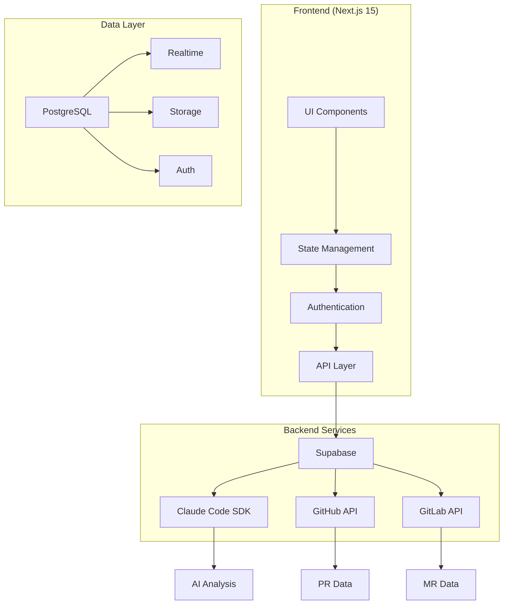
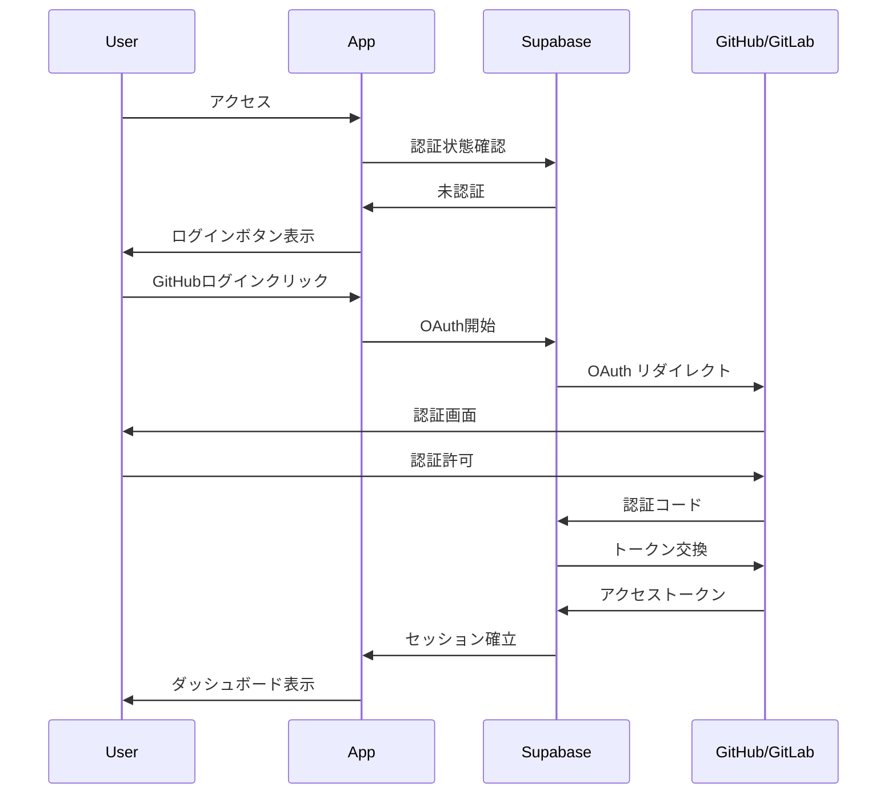

# 完全版設計書（統合版）

## 目次

1. [プロジェクト概要](#1-プロジェクト概要)
2. [技術アーキテクチャ](#2-技術アーキテクチャ)
3. [認証・セキュリティ](#3-認証セキュリティ)
4. [データベース設計](#4-データベース設計)
5. [API設計](#5-api設計)
6. [UI/UX設計](#6-uiux設計)
7. [MVP開発計画](#7-mvp開発計画)
8. [本格開発ロードマップ](#8-本格開発ロードマップ)
9. [運用・保守計画](#9-運用保守計画)
10. [将来展望](#10-将来展望)

---

## 1. プロジェクト概要

### 1.1 プロジェクト名
**Claude Code Review Assistant**

### 1.2 ミッション
GitHub/GitLab の PR/MR に対して、Claude Code SDK を活用した AI-first のコードレビュー補助ツールを開発し、組織固有の開発ルール適用により、実用的で高品質なコードレビューを実現する。

### 1.3 主要価値提案

- **効率化**: レビュー時間30-50%削減
- **品質向上**: 一貫したレビュー基準の適用
- **学習支援**: AI による継続的なフィードバック
- **組織標準化**: CLAUDE.md による組織ルールの統一

### 1.4 ターゲットユーザー

#### プライマリー
- 開発チームリーダー
- シニアエンジニア
- プロジェクトマネージャー

#### セカンダリー
- ジュニアエンジニア
- DevOps エンジニア
- 品質保証チーム

---

## 2. 技術アーキテクチャ

### 2.1 システム構成図



### 2.2 技術スタック

#### フロントエンド
- **Framework**: Next.js 15 (App Router)
- **Language**: TypeScript (厳密モード)
- **State**: Jotai（原子的状態管理）
- **Styling**: Tailwind CSS + shadcn/ui
- **Animation**: Framer Motion

#### バックエンド
- **BaaS**: Supabase (Auth + PostgreSQL + Realtime)
- **API**: Next.js API Routes (Edge Runtime)
- **AI**: Claude Code SDK
- **External**: GitHub API, GitLab API

#### 開発・運用
- **Development**: VS Code + Claude Code
- **Testing**: Vitest + Playwright
- **Deployment**: Vercel + Supabase Pro
- **Monitoring**: Vercel Analytics + Sentry

---

## 3. 認証・セキュリティ

### 3.1 認証フロー



### 3.2 セキュリティ対策

- **認証**: OAuth 2.0 + JWT (Supabase管理)
- **認可**: Row Level Security (RLS)
- **通信**: HTTPS 強制 + HSTS
- **データ保護**: 暗号化 + 定期バックアップ
- **監査**: 全操作のログ記録

---

## 4. データベース設計

### 4.3 主要テーブル

#### ユーザー管理
```sql
-- ユーザープロファイル
CREATE TABLE user_profiles (
  id UUID PRIMARY KEY DEFAULT uuid_generate_v4(),
  user_id UUID REFERENCES auth.users(id) ON DELETE CASCADE,
  provider VARCHAR(50) NOT NULL,
  username VARCHAR(255) NOT NULL,
  display_name VARCHAR(255),
  avatar_url TEXT,
  github_data JSONB,
  gitlab_data JSONB,
  created_at TIMESTAMPTZ DEFAULT NOW()
);
```

#### レビューデータ
```sql
-- レビューメイン
CREATE TABLE reviews (
  id UUID PRIMARY KEY DEFAULT uuid_generate_v4(),
  user_id UUID REFERENCES auth.users(id) ON DELETE CASCADE,
  organization_id UUID REFERENCES organizations(id),
  pr_url TEXT NOT NULL,
  title VARCHAR(500) NOT NULL,
  status VARCHAR(50) DEFAULT 'pending',
  overall_score INTEGER,
  claude_summary TEXT,
  created_at TIMESTAMPTZ DEFAULT NOW()
);

-- 行コメント
CREATE TABLE line_comments (
  id UUID PRIMARY KEY DEFAULT uuid_generate_v4(),
  review_id UUID REFERENCES reviews(id) ON DELETE CASCADE,
  line_number INTEGER NOT NULL,
  severity VARCHAR(50) DEFAULT 'info',
  category VARCHAR(100),
  title VARCHAR(500),
  description TEXT NOT NULL,
  suggested_fix TEXT,
  claude_confidence DECIMAL(3,2),
  created_at TIMESTAMPTZ DEFAULT NOW()
);
```

### 4.4 RLS ポリシー

```sql
-- ユーザーは自分のレビューのみアクセス可能
CREATE POLICY "Users can manage own reviews" ON reviews
  FOR ALL USING (auth.uid() = user_id);

-- 組織メンバーは組織のレビューを閲覧可能
CREATE POLICY "Org members can view org reviews" ON reviews
  FOR SELECT USING (
    organization_id IN (
      SELECT organization_id FROM user_organizations 
      WHERE user_id = auth.uid()
    )
  );
```

---

## 5. API設計

### 5.1 エンドポイント構成

```
/api/
├── auth/
│   ├── callback          # OAuth コールバック
│   └── profile           # ユーザープロファイル
├── github/
│   ├── pr               # PR 情報取得
│   └── file             # ファイル内容取得
├── gitlab/
│   ├── mr               # MR 情報取得
│   └── file             # ファイル内容取得
├── claude/
│   ├── analyze          # コード分析
│   └── batch-analyze    # バッチ分析
├── reviews/
│   ├── [GET/POST]       # レビュー一覧・作成
│   └── [id]/            # 個別レビュー操作
└── rules/
    ├── [GET/POST]       # ルールセット管理
    └── [id]/            # 個別ルールセット
```

### 5.2 型安全性

```typescript
// Zod スキーマ定義
export const CreateReviewSchema = z.object({
  provider: z.enum(['github', 'gitlab']),
  pr_url: z.string().url(),
  organization_id: z.string().uuid().optional(),
  rule_set_ids: z.array(z.string().uuid()).optional()
})

export const AnalysisResultSchema = z.object({
  overall_score: z.number().min(0).max(100),
  summary: z.string(),
  issues: z.array(z.object({
    line_number: z.number(),
    severity: z.enum(['critical', 'major', 'minor', 'info']),
    title: z.string(),
    description: z.string(),
    suggested_fix: z.string().optional()
  }))
})
```

---

## 6. UI/UX設計

### 6.1 デザインシステム

#### カラーパレット
```css
:root {
  --primary: 214 100% 50%;      /* ブルー */
  --success: 142 76% 36%;       /* グリーン */
  --warning: 38 92% 50%;        /* オレンジ */
  --error: 0 84% 60%;           /* レッド */
  
  --code-addition: 142 76% 95%;  /* 追加行 */
  --code-deletion: 0 84% 95%;    /* 削除行 */
  --comment-critical: 0 84% 95%; /* 重要コメント */
}
```

#### コンポーネント階層
```
components/
├── ui/              # 基本UIコンポーネント
├── auth/            # 認証関連
├── reviews/         # レビュー機能
├── diff-viewer/     # 差分表示
├── rules/           # ルール管理
└── layout/          # レイアウト
```

### 6.2 主要画面

1. **ランディングページ**: サービス紹介・認証
2. **ダッシュボード**: レビュー履歴・統計
3. **レビュー画面**: 差分表示・AI分析
4. **ルール管理**: CLAUDE.md エディタ
5. **設定画面**: ユーザー・組織設定

---

## 7. MVP開発計画

### 7.1 開発フェーズ（10-14日）

#### Phase 1: 基盤構築（2-3日）
- Next.js プロジェクト初期化
- Supabase セットアップ
- GitHub OAuth 認証

#### Phase 2: GitHub統合（2-3日）
- GitHub API 統合
- PR情報取得・表示
- 基本UI実装

#### Phase 3: 差分表示（1-2日）
- react-diff-viewer 統合
- ファイル表示・切り替え

#### Phase 4: Claude統合（2-3日）
- Claude Code SDK 統合
- コード分析・結果表示

#### Phase 5: 統合・テスト（1-2日）
- エンドツーエンド統合
- バグ修正・最適化

### 7.2 MVP成功指標

- **技術**: ページロード3秒以内、分析30秒以内
- **機能**: GitHub認証95%、PR取得90%、分析85%成功率
- **UX**: タスク完了率80%、満足度3.5/5以上

---

## 8. 本格開発ロードマップ

### 8.1 v1.1 機能拡張（4-6週間）

#### 主要機能
- GitLab対応
- ルール管理システム
- GitHub/GitLabへの結果投稿
- 組織機能

#### 実装内容
```typescript
// GitLab統合
class GitLabService {
  async getMRData(projectId: string, mrId: number) {
    // GitLab API実装
  }
}

// ルール管理
class RuleManager {
  async loadRuleSet(ruleSetId: string) {
    // CLAUDE.mdファイル読み込み・適用
  }
}

// 結果投稿
class CommentPoster {
  async postToGitHub(prUrl: string, comments: Comment[]) {
    // GitHub PR へのコメント投稿
  }
}
```

### 8.2 v1.2 高度機能（6-8週間）

- リアルタイム協調機能
- 詳細権限管理
- 高度な分析レポート
- Webhook統合

### 8.3 v2.0 エンタープライズ（3-4ヶ月）

- SSO連携（SAML/OIDC）
- API提供
- 高度なカスタマイズ
- オンプレミス対応

---

## 9. 運用・保守計画

### 9.1 監視・メトリクス

#### システム監視
- **可用性**: 99.9%目標
- **レスポンス**: 平均3秒以内
- **エラー率**: 1%以下

#### ビジネス監視
```typescript
// メトリクス収集
class MetricsCollector {
  async trackReviewCreated(userId: string, reviewData: any) {
    await this.sendMetric('review.created', {
      user_id: userId,
      provider: reviewData.provider,
      files_count: reviewData.files.length
    })
  }
  
  async trackAnalysisCompleted(reviewId: string, duration: number) {
    await this.sendMetric('analysis.completed', {
      review_id: reviewId,
      duration_ms: duration,
      timestamp: new Date().toISOString()
    })
  }
}
```

### 9.2 保守計画

#### 定期メンテナンス
- **データベース**: 週次最適化・月次バックアップ
- **依存関係**: 月次セキュリティアップデート
- **パフォーマンス**: 四半期ごとの最適化

#### 障害対応
```typescript
// 障害検知・自動復旧
class HealthChecker {
  async checkSystemHealth() {
    const checks = await Promise.allSettled([
      this.checkDatabase(),
      this.checkClaudeAPI(),
      this.checkGitHubAPI()
    ])
    
    return checks.map((result, index) => ({
      service: ['database', 'claude', 'github'][index],
      status: result.status === 'fulfilled' ? 'healthy' : 'error',
      error: result.status === 'rejected' ? result.reason : null
    }))
  }
}
```

---

## 10. 将来展望

### 10.1 技術的拡張

#### AI機能強化
- 複数AIモデル対応（GPT-4、Gemini等）
- コード自動修正機能
- セキュリティ脆弱性自動検知

#### 統合機能
- VS Code拡張
- IntelliJ IDEA プラグイン
- Slack/Teams統合

### 10.2 市場展開

#### ターゲット拡大
- エンタープライズ市場
- OSS プロジェクト支援
- 教育機関向けプラン

#### 収益モデル
```
Free Tier:
- 月5レビューまで
- 基本AI分析
- コミュニティサポート

Pro Tier ($19/月):
- 無制限レビュー
- 高度AI分析
- 優先サポート

Team Tier ($99/月):
- チーム機能
- 組織ルール管理
- SLA保証

Enterprise Tier (要相談):
- SSO連携
- オンプレミス
- 専任サポート
```

### 10.3 競合優位性

#### 差別化要素
- **AI-First設計**: Claude Code SDKによる高品質分析
- **組織カスタマイズ**: CLAUDE.mdによるルール適用
- **開発者体験**: VS Code + Claude Code統合
- **オープン性**: API提供によるエコシステム構築

#### 継続的改善
- ユーザーフィードバック収集
- A/Bテストによる機能改善
- 最新AI技術の導入
- 業界ベストプラクティスの反映

---

## まとめ

この設計書は、Claude Code SDK を活用したコードレビューツールの完全な実装計画を提示している。MVP から始まり、段階的に機能を拡張してエンタープライズレベルの製品へと成長させる明確な道筋を示している。

### 成功要因
1. **技術的堅実性**: モダンで安定した技術スタック
2. **ユーザー中心設計**: 実際の開発ワークフローに適合
3. **段階的開発**: MVPから始まる現実的な開発計画
4. **スケーラビリティ**: 将来の成長に対応する設計

### 次のステップ
1. MVP開発の開始
2. 初期ユーザーテストの実施
3. フィードバックに基づく改善
4. 本格版開発の準備

この設計に従って開発を進めることで、市場のニーズに応える価値のあるコードレビューツールを構築できる。